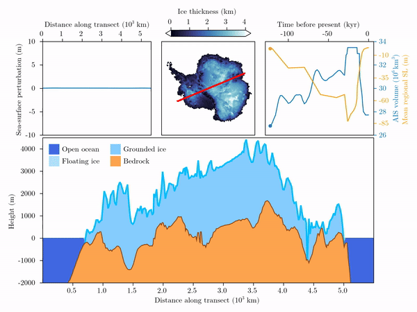

# FastIsostasy.jl

[](https://janjereczek.github.io/FastIsostasy.jl/dev/)
[](https://www.gnu.org/licenses/gpl-3.0.en.html)
[](https://egusphere.copernicus.org/preprints/2023/egusphere-2023-2869/#discussion)
[![][ci-img]][ci-url]
[![][codecov-img]][codecov-url]
<!-- [](https://codecov.io/gh/JuliaDynamics/TransitionsInTimeseries.jl) -->

[ci-img]: https://github.com/JanJereczek/FastIsostasy.jl/workflows/CI/badge.svg
[ci-url]: https://github.com/JanJereczek/FastIsostasy.jl/actions

[codecov-img]: https://codecov.io/gh/JanJereczek/FastIsostasy.jl/branch/master/graph/badge.svg
[codecov-url]: https://codecov.io/gh/JanJereczek/FastIsostasy.jl


❄ *Fast and friendly glacial isostatic adjustment on CPU and GPU.*

### Simulating the GIA response of Antarctica during the last glacial cycle with FastIsosatsy




The two animations above visualise the results of FastIsostasy when forced by ICE6G_D and an external regional mean sea level:
1. On the left, the anomaly of ice thickness with respect to the Last Interglacial and, on the right, the bedrock displacement resulting from it.
2. A transect of Antarctica between the Thwaites and Amery glaciers.

This computation is performed with $N_{x} = N_{y} = 350$. On a low-cost GPU, the computation is a matter of minutes and only requires few lines of code. For more details, see the [docs](https://janjereczek.github.io/FastIsostasy.jl/dev/).

## What is FastIsosatsy?

FastIsostasy is a friendly and flexible model that regionally computes the glacial isostatic adjustment (GIA) with laterally-variable mantle viscosity and lithospheric thickness. It is mainly adressed to ice-sheet modellers who seek for (1) a good representation of solid-Earth mechanics at virtually zero computational cost, (2) an approximation of the sea-level equation and (3) ready-to-use inversion tools to calibrate the model parameters to data. The simple interface of FastIsostasy allows to flexibly solve GIA problems within few lines of code. Its open-source code is distributed under GPL3 license and was succesfully benchmarked against analytical, 1D GIA and 3D GIA model solutions.

FastIsostasy relies on a hybrid Fourier/finite-difference collocation of the problem introduced in Cathles (1975) and solved in Lingle and Clark (1985), Bueler et al. (2007). Thanks to a simplification of the full problem from 3D to 2D space and the use of optimized software packages, running kiloyears of regional GIA with $\Delta x = \Delta y = 45 \, \mathrm{km}$ is a matter of seconds on a single CPU. For high resolution runs, the user can switch to GPU usage with minimal syntax change and enjoy the advantage of parallelization without requiring an HPC cluster. For GIA "purists", this package is likely to miss interesting processes but we belive that its ridiculous run-time can help fast-prototyping a problem before transfering it to a more comprehensive model.

## Getting started

FastIsostasy.jl is a registered julia package. To install it, please run:

```julia
using Pkg
Pkg.add("FastIsostasy")
```

## Publications

For more information on the model devlopment and validation, please check out our [preprint](https://egusphere.copernicus.org/preprints/2023/egusphere-2023-2869/#discussion).