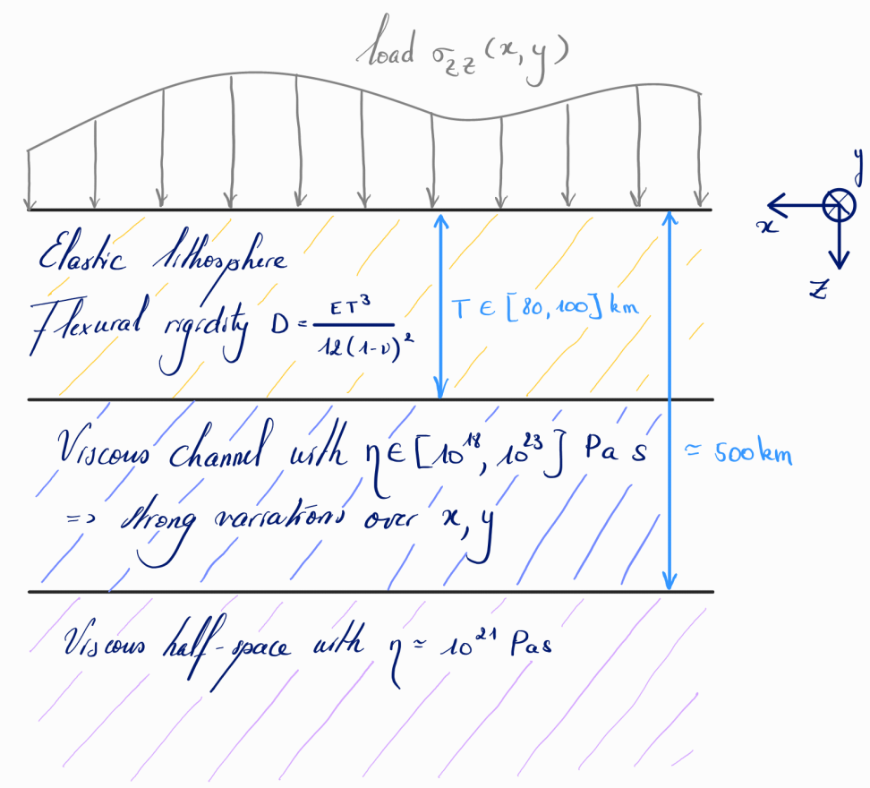

# FastIsostasy

This package is mainly addressed to ice sheet modellers looking for a regional model of glacial isostatic adjustment (GIA) that (1) captures the 3D structure of solid-Earth parameters, (2) computes an approximation of the sea-level equation, (3) runs kiloyear simulations on high resolution within minutes (without the need of HPC hardware) and (4) comes with ready-to-use calibration tools. For GIA "purists", this package is likely to miss interesting processes but we belive that the ridiculous run-time of FastIsostasy.jl can help them to perform some fast prototypting of a problem they might then transfer to a more comprehensive model.

The animation below depicts:
 a. The ice-load anomaly with respect to 30 kiloyears before present as reconstructed in [GLAC1D](https://www.physics.mun.ca/~lev/dataAccess.html). Thus essentially simulate the isostatic adjustment induced by the last deglaciation.
 b. The displacement rate of the bedrock resulting from changes in the ice load.
 c. The total displacement obtained by integrating the rate.

 -->

<!-- Glacial isostatic adjustment (GIA) denotes the bedrock displacement that results from changes in ice thickness. It is an important process for ice-sheet modelling, and more generally for Earth system modelling. `FastIsostasy.jl` performs the computation of this displacement based on a Fourier collocation method described in [[1](https://agupubs.onlinelibrary.wiley.com/doi/abs/10.1029/JC090iC01p01100?casa_token=OEMWq5llrv4AAAAA:ok6M08OGPEbkORk44DO2apRXUPo7GkQrl2iwclQXXs6laMyI644GI7_XoluKjKSxWiJLAP5r91uQLeI), [2](https://www.cambridge.org/core/journals/annals-of-glaciology/article/fast-computation-of-a-viscoelastic-deformable-earth-model-for-icesheet-simulations/C878DBDD01271F6EB7874C9C4125196C)]. This allows to transform the PDE describing the physics into an ODE and accelerate the computation, mainly due to the highly optimized functions available for fast-fourier transform (FFT). -->

<!-- Compared to [1, 2], FastIsostasy.jl does not assume constant fields for parameters of the solid Earth. It thus offers an open-source and performant generalization of the original articles. -->

<!-- ## Getting started

`FastIsostasy.jl` is work under development and must be downloaded from GitHub to be used. It will hopefully become a registered julia package in the future. -->
<!-- 
## A three-layer model

Let x, y be the coordinates spanning the projection of the Earth surface and z the depth coordinate. The present model assumes three layers over the z-dimension:
- The elastic lithosphere.
- A channel representing the upper mantle, usually displaying strong variance of viscosity over x and y.
- A half-space representing the rest of the mantle, usually with small variance of viscosity over x and y.
The two-layer model is a special case of this and can be obtained by setting the channel parameters to be the same as the ones of the half space.

 -->