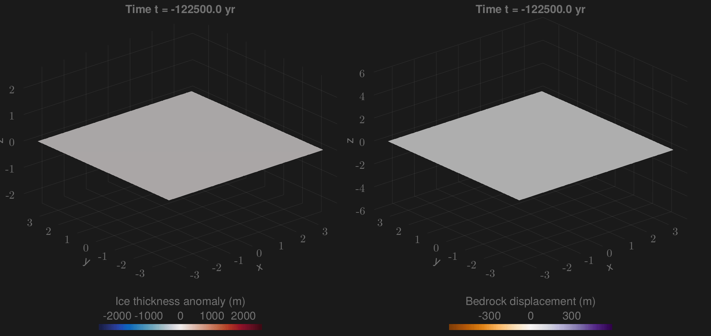

# FastIsostasy.jl

[](https://janjereczek.github.io/FastIsostasy.jl/dev/)

❄ *Fast and friendly glacial isostatic adjustment on CPU and GPU.*



FastIsostasy is a friendly and flexible model that regionally computes the glacial isostatic adjustment (GIA) with laterally-variable mantle viscosity and lithospheric thickness. It is mainly adressed to ice-sheet modellers who seek for (1) a good representation of solid-Earth mechanics at virtually zero computational cost, (2) an approximation of the sea-level equation and (3) ready-to-use inversion tools to calibrate the model parameters to data. The simple interface of FastIsostasy allows to flexibly solve GIA problems within few lines of code. It is fully open-source under MIT license and was succesfully benchmarked against analytical, 1D GIA and 3D GIA model solutions.

FastIsostasy relies on a hybrid Fourier/finite-difference collocation of the problem introduced in Cathles (1975) and solved in Lingle and Clark (1985), Bueler et al. (2007). Thanks to a simplification of the full problem from 3D to 2D space and the use of optimized software packages, running kiloyears of regional GIA with $\Delta x = \Delta y \simeq 50 \, \mathrm{km}$ is a matter of seconds on a single CPU. For high resolution runs, the user can switch to GPU usage with minimal syntax change and enjoy the advantage of parallelization without requiring an HPC cluster. For GIA "purists", this package is likely to miss interesting processes but we belive that its ridiculous run-time can help to fast-prototype a problem before transfering it to a more comprehensive model.


## Getting started

FastIsostasy.jl is a registered julia package. To install it, please run:

```julia
using Pkg
Pkg.add("FastIsostasy")
```

## Example

The animation above depicts:
- The anomaly of ice thickness with respect to the Last Interglacial.
- The bedrock displacement resulting from it.

This computation is performed with $N_{x} = N_{y} = 350$. On a modern GPU of intermediate performance, the computation is a matter of minutes and only requires few lines of code. For more details, see the [docs](https://janjereczek.github.io/FastIsostasy.jl/dev/).