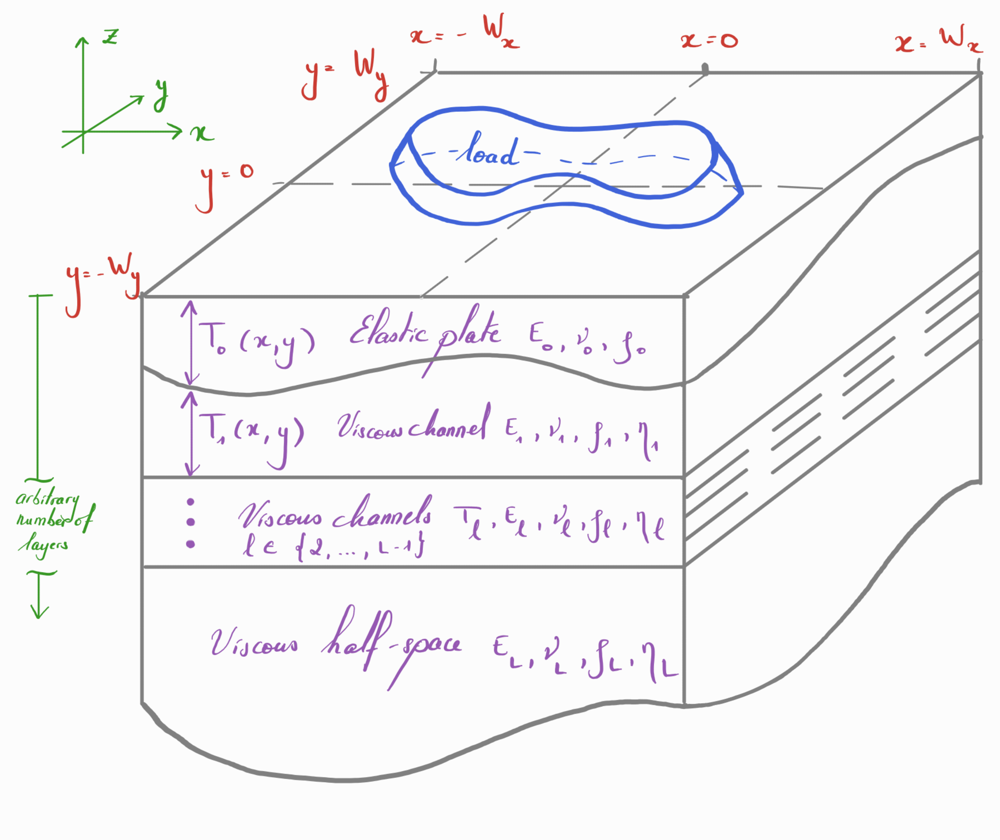

# Examples

## Multi-layer Earth

FastIsostasy relies on a (polar) stereographic projection that allows to treat the radially-layered, onion-like structure of the solid Earth as a superposition of horizontal layers. Furthermore, FastIsostasy reduces this 3D problem into a 2D problem by collapsing the depth dimension, mainly through the computation of an effective viscosity field that accounts for the superposition of layers with different viscosities. The user is required to provide the 3D information, which will then be used under the hood to compute the effective viscosity. This tutorial shows such an example.

We want to render a situation similar to the one depicted below:



Initializing a [`LateralVariability`](@ref) with parameters corresponding to this situation automatically computes the conversion from a 3D to a 2D problem. This can be simply executed by running:

```@example MAIN
using FastIsostasy

W = 3000e3      # (m) half-width of the domain Wx = Wy
n = 7           # implies an Nx x Ny grid with Nx = Ny = 2^n = 64.
Omega = ComputationDomain(W, n)
c = PhysicalConstants(rho_litho = 0.0)

lv = [1e19, 1e21]       # (Pa s)
lb = [88e3, 400e3]      # (m)
p = LateralVariability(Omega, layer_viscosities = lv, layer_boundaries = lb)
extrema(p.effective_viscosity)
```

As expected, the effective viscosity is a homogeneous field. It corresponds to a nonlinear mean of the layered values provided by the user. Note that we have set \$\ŗho_\mathrm{litho} = 0\$ to prevent the lithosphere from contributing to the hydrostatic, upward force. This is made to comply with the later computed analytical solution, which assumes a purely elastic lithosphere. In reality, this is however arguably wrong and the default choice `c = PhysicalConstants()` therefore uses \$ \ŗho_\mathrm{litho} = 2600 \, \mathrm{kg \, m^{-3}} \$.

The next section shows how to use the now obtained `p::LateralVariability` for actual GIA computation.

## Simple load and geometry

We now apply a constant load, here a cylinder of ice with radius \$ R = 1000 \, \mathrm{km} \$ and thickness \$H = 1 \, \mathrm{km}\$, over `Omega::ComputationDomain` introduced in [Multi-layer Earth](@ref). To formulate the problem conviniently, we use [`FastIsoProblem`](@ref), a struct containing the variables and options that are necessary to perform the integration over time. We can then simply apply `solve!(fip::FastIsoProblem)` to perform the integration of the ODE. Under the hood, the ODE is obtained from the PDE by applying a Fourier collocation scheme contained in [`dudt_isostasy!`](@ref). The integration is performed according to `FastIsoProblem.diffeq::NamedTuple`, which contains the algorithm and optionally tolerances, maximum iteration number... etc.

```@example MAIN
using CairoMakie

R = 1000e3                  # ice disc radius (m)
H = 1e3                     # ice disc thickness (m)
Hice = uniform_ice_cylinder(Omega, R, H)
t_out = years2seconds.([0.0, 200.0, 600.0, 2000.0, 5000.0, 10_000.0, 50_000.0])
interactive_sealevel = false
fip = FastIsoProblem(Omega, c, p, t_out, interactive_sealevel, Hice)
solve!(fip)

function plot3D(fip, k_idx)
    X, Y, out = Array(fip.Omega.X), Array(fip.Omega.Y), fip.out
    zl = extrema(out.ue[end] + out.u[end])
    fig = Figure(fontsize = 10)
    for j in eachindex(k_idx)
        ax = Axis3(fig[1, j])
        u_tot = out.ue[k_idx[j]] + out.u[k_idx[j]]
        surface!(ax, X, Y, u_tot, colormap = :cool)
        wireframe!(ax, X, Y, u_tot, color = :black, linewidth = 0.1)
        zlims!(ax, zl)
    end
    return fig
end
plot3D(fip, [lastindex(t_out) ÷ 2, lastindex(t_out)])
```

... and here goes the total displacement at \$t = 50 \, \mathrm{kyr}\$. You can now access the elastic and viscous displacement at time `t_out[k]` by respectively calling `fip.out.ue[k]` and `fip.out.u[k]`. For the present case, the latter can be compared to an analytic solution that is known for this particular case. Let's look at the accuracy of our numerical scheme over time by running following plotting commands:

```@example MAIN
fig = Figure()
ax = Axis(fig[1, 1])
cmap = cgrad(:jet, length(t_out), categorical = true)
ii, jj = Omega.Mx:Omega.Nx, Omega.My
x = Omega.X[ii, jj]
r = Omega.R[ii, jj]

# A support vector for computing the analytical solution
vsupport = vcat(1.0e-14, 10 .^ (-10:0.05:-3), 1.0)

for k in eachindex(t_out)
    analytic_solution_r(r) = analytic_solution(r, t_out[k], c, p, H, R, vsupport)
    u_analytic = analytic_solution_r.(r)
    u_numeric = fip.out.u[k][ii, jj]
    lines!(ax, x, u_analytic, color = cmap[k], linewidth = 5,
        label = L"$u_{ana}(t = %$(round(seconds2years(t_out[k]))) \, \mathrm{yr})$")
    lines!(ax, x, u_numeric, color = cmap[k], linewidth = 5, linestyle = :dash,
        label = L"$u_{num}(t = %$(round(seconds2years(t_out[k]))) \, \mathrm{yr})$")
end
axislegend(ax, position = :rb, nbanks = 2, patchsize = (50.0f0, 20.0f0))
fig
```

That looks pretty good! One might however object that the convenience function [`fastisostasy`](@ref) ends up being not so convenient as soon as the ice load changes over time. This case can however be easily handled, as shown in the next section.

### GPU support

For about $n > 7$, the previous example can be computed even faster by using GPU parallelism. It could not represent less work from the user's perspective, as it boils down to calling [`ComputationDomain`](@ref) with an extra keyword argument and passing it to a `::LateralVariability` with the viscosity and depth values defined earlier:

```@example MAIN
n = 8
Omega = ComputationDomain(W, n, use_cuda = true)
p = LateralVariability(Omega, layer_viscosities = lv, layer_boundaries = lb)
Hice = uniform_ice_cylinder(Omega, R, H)
fip = FastIsoProblem(Omega, c, p, t_out, interactive_sealevel, Hice)
solve!(fip)
plot3D(fip, [lastindex(t_out) ÷ 2, lastindex(t_out)])
```

That's it, nothing more! For postprocessing, consider using [`reinit_structs_cpu`](@ref).

!!! info "Only CUDA supported!"
    For now only Nvidia GPUs are supported and there is no plan of extending this compatibility at this point.

## Make your own time loop

As any high-level function, [`solve!`](@ref) has some limitations. An ice-sheet modeller typically wants to embed FastIsostasy within a time-stepping loop. This can be easily done by getting familiar with some intermediate-level functions like [`init`](@ref), [`step!`](@ref) and [`write_out!`](@ref):

```@example MAIN
Omega = ComputationDomain(3000e3, 6)
p = LateralVariability(Omega)
Hice = uniform_ice_cylinder(Omega, R, H)
fip = FastIsoProblem(Omega, c, p, t_out, interactive_sealevel, Hice)

update_diagnostics!(fip.geostate.dudt, fip.geostate.u, fip, 0.0)
write_out!(fip, 1)
ode = init(fip)
@inbounds for k in eachindex(fip.out.t)[2:end]
    step!(fip, ode, (fip.out.t[k-1], fip.out.t[k]))
    write_out!(fip, k)
end
plot3D(fip, [lastindex(t_out) ÷ 2, lastindex(t_out)])
```

!!! info "Coupling to julia Ice-Sheet model"
    In case your Ice-Sheet model is programmed in julia, we highly recommend performing
    the coupling within the function updating the derivatives and let `OrdinaryDiffEq.jl`
    handle the rest.

!!! info "GPU not supported"
    [`step!`] does not support GPU computation so far. Make sure your model is initialized
    on CPU!
## Antarctic deglaciation

We now want to provide an example that presents:
- a heterogeneous lithosphere thickness
- a heterogeneous upper-mantle viscosity
- various viscous channels
- a more elaborate load that evolves over time
- changes in the sea-level

For this we run a deglaciation of Antarctica with lithospheric thickness and upper-mantle viscosity from [^Wiens2021] and the ice thickness history from [^Briggs2014]. Since the load is known and the isostatic response does not influence it (one-way coupling), we can provide snapshots of the ice thickness and their associated time to [`FastIsoProblem`](@ref). Under the hood, an interpolator is created and called within the time integration. 

```@example MAIN
W = 3000e3      # (m) half-width of the domain
n = 7           # implies an NxN grid with N = 2^n = 128.
Omega = ComputationDomain(W, n)
c = PhysicalConstants()
```

## Inversion of viscosity field

FastIsostasy.jl relies on simplification of the full problem and might therefore need a calibration step to match the data, typically obtained from observations or from a "golden-standard" 3D GIA model. By means of an unscented Kalman inversion, one can e.g. infer the appropriate field of effective mantle viscosity that matches the data best. Whereas this is known to be a tedious step, FastIsostasy is developped to ease the procedure by providing a convenience struct [`Paraminversion`](@ref) that can be run by:

```@example MAIN
Omega = ComputationDomain(3000e3, 6)
lb = [88e3, 180e3, 280e3, 400e3]
lv = load_wiens2021(Omega)
p = LateralVariability(Omega, layer_boundaries = lb, layer_viscosities = lv)
R, H = 2000e3, 1e3
Hcylinder = uniform_ice_cylinder(Omega, R, H)
Hice = [Hcylinder for t in t_out]
t_out = years2seconds.(1_000.0:1_000.0:2_000.0)
fip = FastIsoProblem(Omega, c, p, t_out, interactive_sealevel, Hice)
solve!(fip)
ground_truth = copy(p.effective_viscosity)

config = InversionConfig()
data = InversionData(t_out, fip.out.u, Hice, config)
paraminv = ParamInversion(Omega, c, p, config, data)
priors, ukiobj = perform(paraminv)
logeta, Gx, e_mean, e_sort = extract_inversion(priors, ukiobj, paraminv)
```

[^Wiens2021]:
    Douglas Wiens et al. (2021): [The seismic structure of the Antarctic upper mantle](https://doi.org/10.1144/M56-2020-18)

[^Briggs2014]:
    Robert Briggs et al. (2014): [A data constrained large ensemble analysis of Antarctic evolution since the Eemian](https://doi.org/10.1016/j.quascirev.2014.09.003)