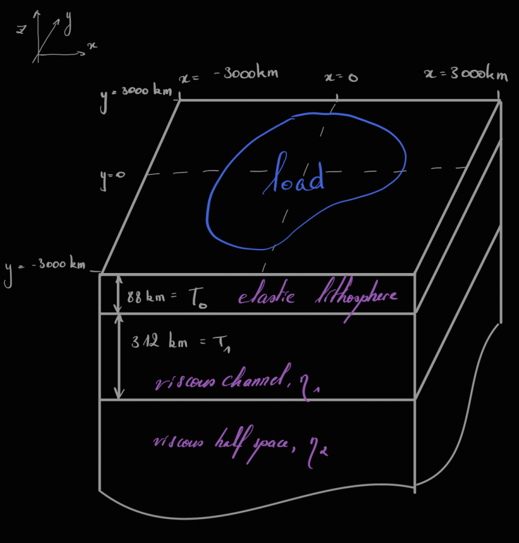

# Examples

## Multi-layer Earth

FastIsostasy relies on a (polar) stereographic projection that allows to treat the radially-layered, onion-like structure of the solid Earth as a superposition of horizontal layers. Furthermore, FastIsostasy reduces this 3D problem into a 2D problem by collapsing the depth dimension by computing an effective viscosity field. The user is required to provide the 3D information, which will then be used under the hood to compute the effective viscosity. This tutorial shows such an example.

We want to render a situation similar to the one depicted below:



Initializing a [`LateralVariability`](@ref) with parameters corresponding to this situation automatically computes the conversion from a 3D to a 2D problem. This can be simply executed by running:

```@example MAIN
using FastIsostasy

W = 3000e3      # (m) half-width of the domain
n = 6           # implies an NxN grid with N = 2^n = 64.
Omega = ComputationDomain(W, n)
c = PhysicalConstants()

lv = [1e19, 1e21]       # (Pa*s)
lb = [88e3, 400e3]      # (m)
p = LateralVariability(Omega, layer_viscosities = lv, layer_boundaries = lb)
```

The next section shows how to use the now obtained `p::LateralVariability` for actual GIA computation.

## Simple load and geometry

We now apply a constant load, here a cylinder of ice with radius $R = 1000 km$ and thickness $H = 1 km$, over the domain introduced in [Multi-layer Earth](@ref). To obtain the bedrock displacement over time and store it at time steps specified by a vector `t_out`, we can use the convenience function [`fastisostasy`](@ref):

```@example MAIN
using CairoMakie

R = 1000e3                  # ice disc radius (m)
H = 1000.0                  # ice disc thickness (m)
Hice = uniform_ice_cylinder(Omega, R, H)
t_out = years2seconds.([0.0, 100.0, 500.0, 1500.0, 5000.0, 10_000.0, 50_000.0])

results = fastisostasy(t_out, Omega, c, p, Hice, ODEsolver = BS3())
fig, ax, srf = surface(Omega.X, Omega.Y, results.elastic[end] + results.viscous[end],
    axis=(type=Axis3,), colormap = :cool)
fig
```

And here goes the total displacement at the end of the simulation! You can now easily access the elastic and viscous displacement by calling `results.elastic` or `results.viscous`. For the present case, the latter can be compared to an analytic solution that is known for this particular case. Let's look at the accuracy of our numerical scheme over time by running following plotting commands:

```@example 2
M = Omega.N ÷ 2
x = diag(Omega.X)[1:M]
y = diag(Omega.Y)[1:M]
r = sqrt.( x .^ 2 + y .^ 2 )

fig = Figure()
ax3 = Axis(fig[1, 1])
colors = [:gray80, :gray65, :gray50, :gray35, :gray20, :gray5]

for i in eachindex(t_out)
    t = t_out[i]
    analytic_solution_r(r) = analytic_solution(r, t, c, p, H, R, analytic_support)
    u_analytic = analytic_solution_r.( r )
    u_numeric = diag(results.viscous[i])
    lines!(ax3, x, u_numeric[1:M], color = colors[i], linewidth = 5)
    lines!(ax3, x, u_analytic, color = colors[i], linewidth = 5, linestyle = :dash)
end
fig
```

### Time-changing load

That looks pretty good! One might however object that the convenience function [`fastisostasy`](@ref) ends up being not so convenient as soon as the ice load changes over time. This case can however be easily handled by providing snapshots of the ice thickness and their assoicated time. By passing this to [`fastisostasy`](@ref), an interpolator is created and called within the time integration. Let's create a tool example where the thickness of the ice cylinder asymptotically grows from 0 to 1 km, this can be implemented by:

```@example 2
normalized_asymptote(t) = 1 - exp(-t)
t_Hice_asymptotic = 0:10.0:t_out[end]
Hice_asymptotic = [normalized_asymptote(t) .* Hice for t in t_Hice_asymptote]
results = fastisostasy(t_out, Omega, c, p, t_Hice_asymptotic, Hice_asymptotic)
```

This concept will also apply to the upper-mantle viscosity in future versions, as it can change over time.

### GPU support

For about $n > 6$, the previous example can be computed even faster by using GPU parallelism. It could not represent less work from the user's perspective, as it boils down to calling the `ComputationDomain` with an extra keyword argument:

```@example MAIN
Omega = ComputationDomain(W, n, use_cuda=true)
```

That's it, nothing more! One could suggest you lay back but your computation might be completed too soon for that.

!!! info "Only CUDA supported!"
    For now only Nvidia GPUs are supported (sorry Mac users, destiny is taking its revenge upon you for being so cool) and there is no plan of extending this compatibility at this point.

## Simple load and geometry - DIY

Nonetheless, as any high-level convenience function, [`fastisostasy`](@ref) has limitations. An ice-sheet modeller typically wants to embed FastIsostasy within a time-stepping loop. This can be easily done by getting familiar with some intermediate-level functions. We here illustrate this by letting an ice cap grow over time. This growth is unphysical for the sake of keeping the example simple. 

```@example MAIN
W = 3000e3      # (m) half-width of the domain
n = 6           # implies an NxN grid with N = 2^n = 64.
Omega = ComputationDomain(W, n)
c = PhysicalConstants()
p = LateralVariability(Omega)

R = 1000e3                  # ice disc radius (m)
H = 1000.0                  # ice disc thickness (m)

# for t in 0.0:1.0
# results = fastisostasy(t_out, Omega, c, p, Hice)
```

## GIA following Antarctic deglaciation

We now want to provide a tough example that presents:
- a heterogeneous lithosphere thickness
- a heterogeneous upper-mantle viscosity
- various viscous channels
- a more elaborate load that evolves over time
- changes in the sea-level

For this we run a deglaciation of Antarctica, based on the ice thickness estimated in [GLAC1D]().

```@example 4
W = 3000e3      # (m) half-width of the domain
n = 8           # implies an NxN grid with N = 2^n = 256.
Omega = ComputationDomain(W, n)
c = PhysicalConstants()
```

## Inversion of solid-Earth parameters

FastIsostasy.jl relies on simplification of the full problem and might therefore need a calibration step to match the output of a 3D GIA model. By means of an unscented Kalman inversion, one can e.g. infer the appropriate effective upper-mantle viscosity based on the response of a 3D GIA model to a given load. Whereas this is know to be a tedious step, FastIsostasy is developped to ease the procedure by providing a convenience struct `Paraminversion` that can be run by:

```@example 5
W = T(3000e3)               # half-length of the square domain (m)
Omega = ComputationDomain(W, n)
c = PhysicalConstants()

lb = [88e3, 180e3, 280e3, 400e3]
lv = get_wiens_layervisc(Omega)
p = LateralVariability(
    Omega,
    layer_boundaries = lb,
    layer_viscosities = lv,
)
ground_truth = copy(p.effective_viscosity)

R = T(2000e3)               # ice disc radius (m)
H = T(1000)                 # ice disc thickness (m)
Hcylinder = uniform_ice_cylinder(Omega, R, H)
t_out = years2seconds.(0.0:1_000.0:2_000.0)

t1 = time()
results = fastisostasy(t_out, Omega, c, p, Hcylinder, ODEsolver=BS3(), interactive_geostate=false)
t_fastiso = time() - t1
println("Took $t_fastiso seconds!")
println("-------------------------------------")

tinv = t_out[2:end]
Hice = [Hcylinder for t in tinv]
Y = results.viscous[2:end]
paraminv = ParamInversion(Omega, c, p, tinv, Y, Hice)
priors, ukiobj = perform(paraminv)
logeta, Gx, e_mean, e_sort = extract_inversion(priors, ukiobj, paraminv)
```

