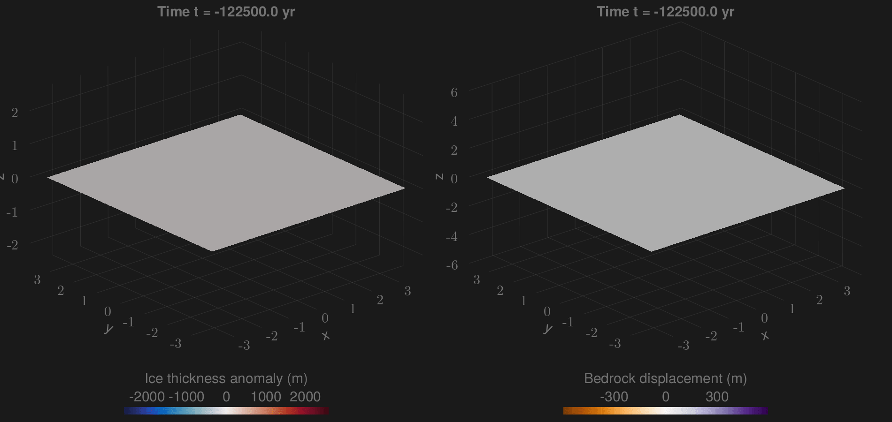

# FastIsostasy.jl

❄ *Fast and friendly glacial isostatic adjustment on CPU and GPU.*



FastIsostasy is a friendly and flexible model that regionally computes the glacial isostatic adjustment (GIA) with laterally-variable mantle viscosity and lithospheric thickness. It is described in [swierczek2024fastisostasy](@citet) and is mainly adressed to ice-sheet modellers who seek for (1) a good representation of solid-Earth mechanics at virtually zero computational cost, (2) an approximation of the sea-level equation and (3) ready-to-use inversion tools to calibrate the model parameters to data. The simple interface of FastIsostasy allows to flexibly solve GIA problems within a few lines of code. The code is distributed under GNU general public license v3 and was succesfully benchmarked against analytical, 1D GIA and 3D GIA model solutions.

Based on the work of [cathles-viscosity-1975](@citet) and [lingle-numerical-1985](@citet), an efficient way of solving for the vertical displacement was proposed by [bueler-fast-2007](@citet). FastIsostasy generalises this approach by relying on a hybrid Fourier/finite-difference collocation. Thanks to a simplification of the full problem from 3D to 2D space and the use of [optimized software packages](@ref Juliaecosystem), running kiloyears of regional GIA with $$\Delta x = \Delta y = 45 \, \mathrm{km}$$ is a matter of seconds on a single CPU. For high resolution runs, the user can switch to GPU usage with minimal syntax change and enjoy the advantage of parallelization without requiring an HPC cluster. For GIA "purists", this package is likely to miss interesting processes but we belive that its ridiculous run-time can help to fast-prototype a problem before transfering it to a more comprehensive model.

!!! tip "Star us on GitHub!"
    If you have found this library useful, please consider starring it on [GitHub](https://github.com/JanJereczek/FastIsostasy.jl). This gives us a lower bound of the satisfied user count.

## Getting started

FastIsostasy.jl is a registered julia package. To install it, please run:

```julia
using Pkg
Pkg.add("FastIsostasy")
```

## How to read the docs?

If you want a quick introduction to GIA, please go to [Quick intro to GIA](@ref). If you want to have a thorough but still accessbile introduction to GIA, we highly recommend reading [whitehouse-solid-2019](@citet). If you want to get started right away, feel free to directly go to the [Tutorial](@ref). If you face any problem using the code or want to know more about the functionalities of the package, visit the [API reference](@ref). If you face a problem you cannot solve, please open a [GitHub issue](https://github.com/JanJereczek/FastIsostasy.jl/issues) with a minimal and reproduceable example. We also welcome feature requests!

## How to cite?

Swierczek-Jereczek, J., Montoya, M., Latychev, K., Robinson, A., Alvarez-Solas, J., & Mitrovica, J. (2024). FastIsostasy v1.0 – a regional, accelerated 2D glacial isostatic adjustment (GIA) model accounting for the lateral variability of the solid Earth. *Geoscientific Model Development, 17*(13), 5263-5290.

## [Julia ecosystem](@id Juliaecosystem)

FastIsostasy.jl was written thanks to the sheer amount of work that people invested in the vast and well-documented Julia ecosystem. Major help from packages deserves major appreciation, in particular for:
- [FFTW.jl](https://github.com/JuliaMath/FFTW.jl)
- [CUDA.jl](https://github.com/JuliaGPU/CUDA.jl)
- [ParallelStencil.jl](https://github.com/omlins/ParallelStencil.jl)
- [Interpolations.jl](https://github.com/JuliaMath/Interpolations.jl)
- [OrdinaryDiffEq.jl](https://github.com/SciML/OrdinaryDiffEq.jl)
- [DynamicalSystemsBase.jl](https://github.com/JuliaDynamics/DynamicalSystemsBase.jl)
- [KalmanEnsembleProcesses.jl](https://github.com/CliMA/EnsembleKalmanProcesses.jl)
- [SpecialFunctions.jl](https://github.com/JuliaMath/SpecialFunctions.jl)
- [FastGaussQuadrature.jl](https://github.com/JuliaApproximation/FastGaussQuadrature.jl)
- And all the fantastic development tools that ease the every-day work so much: [Documenter.jl](https://github.com/JuliaDocs/Documenter.jl), [Literate.jl](https://github.com/fredrikekre/Literate.jl), [Test.jl](https://github.com/JuliaLang/julia/tree/master/usr/share/julia/stdlib/v1.9/Test) and [DocumenterCitations.jl](https://github.com/JuliaDocs/DocumenterCitations.jl). Despite being quite unrelated, [Oceananigans](https://github.com/CliMA/Oceananigans.jl) was a great template of how well geoscientific models can be documented.