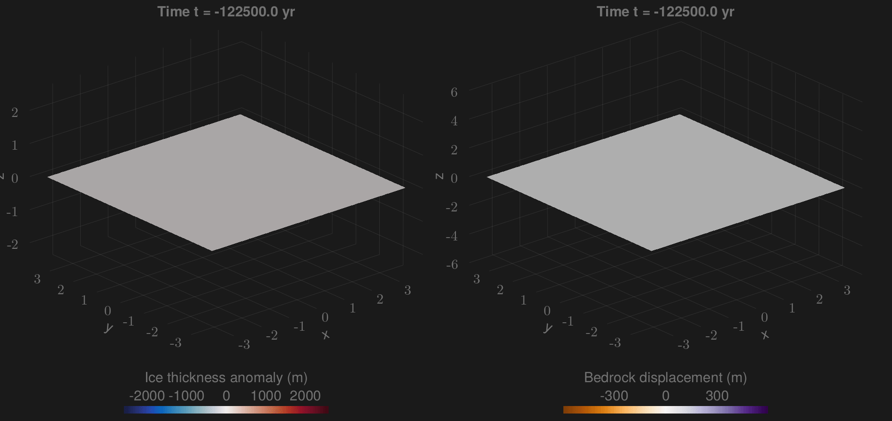

# FastIsostasy.jl

❄ *Fast and flexible glacial isostatic adjustment on CPU and GPU.*



FastIsostasy is a collection of models to compute the regional glacial isostatic adjustment (GIA) resulting from changes in the surface load (ice, liquid water and sediments). It is:
- Accessible: you can set up complex simulations with only a few lines of code (c.f. examples).
- Flexible: you can easily permute parameters and modelling choices.
- Performant: the results obtained only marginally differ from those obtained by 1D and 3D GIA models, while displaying a speed-up of 2 to 6 orders of magnitude.

!!! tip "Star us on GitHub!"
    If you have found this library useful, please consider starring it on [GitHub](https://github.com/JanJereczek/FastIsostasy.jl). This gives us a lower bound of the satisfied user count.

## Getting started

FastIsostasy.jl is a registered julia package. To install it, simply run:

```julia
using Pkg
Pkg.add("FastIsostasy")
```

!!! warning "Upgrade to v2.0!"
    FastIsostasy.jl has been refactored under v2.0 to fix some performance issues, offer a more versatile API and propose new features. We strongly encourage to download v2.0 by running:
    
    ```julia
    ] add https://github.com/JanJereczek/FastIsostasy.jl
    ```

    This version will soon be registered and available through the usual `Pkg.add("FastIsostasy")` command.


## How to read the docs?

If you want a quick introduction to GIA, please go to [Quick intro to GIA](@ref). If you want to get started right away with forward runs, please go to the corresponding examples. If you want to tackle an inversion problem, you are free to directly go to the corresponding examples, but we recommend getting familiar with forward modelling first. If you face any problem using the code or want to know more about the functionalities of the package, visit the [Public API](@ref). If you face a problem you cannot solve, please open a [GitHub issue](https://github.com/JanJereczek/FastIsostasy.jl/issues) with a minimal and reproduceable example. We also welcome feature requests!

## How to cite?

Swierczek-Jereczek, J., Montoya, M., Latychev, K., Robinson, A., Alvarez-Solas, J., & Mitrovica, J. (2024). FastIsostasy v1.0 – a regional, accelerated 2D glacial isostatic adjustment (GIA) model accounting for the lateral variability of the solid Earth. *Geoscientific Model Development, 17*(13), 5263-5290.